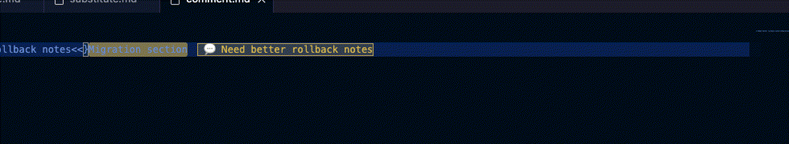
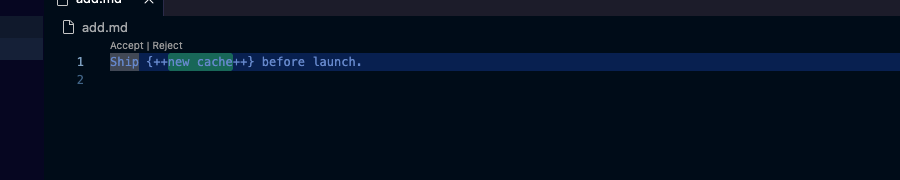
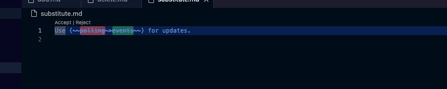
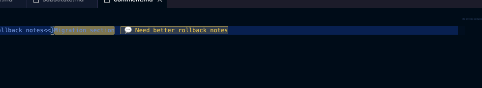
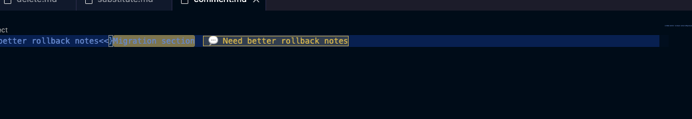
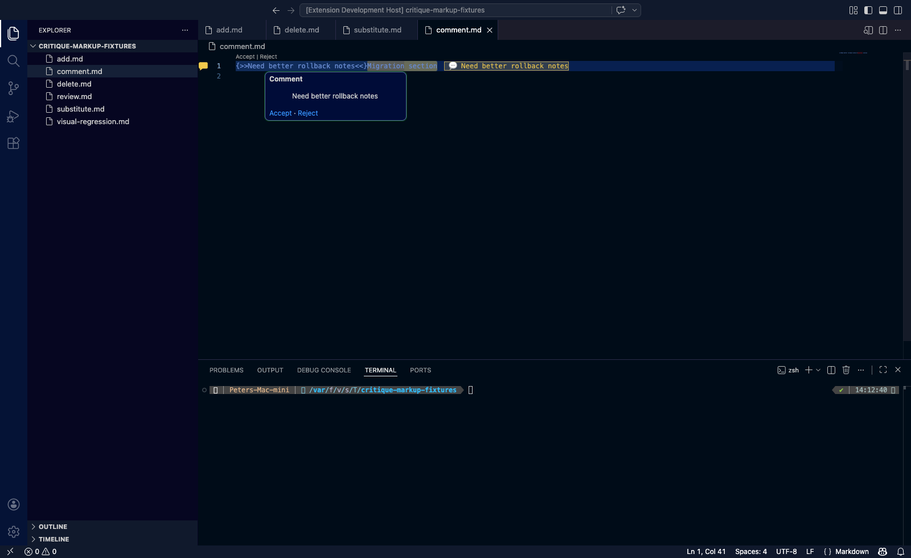
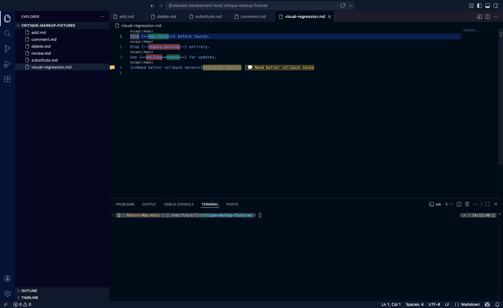

# Critique Markup

Review AI-written Markdown plans in VS Code like an editor, not like a caveman staring at raw markup.

Critique Markup renders **Critic Markup** directly inside the editor with color-coded changes, inline review controls, gutter indicators, and comment hovers — so you can read and revise planning docs without leaving normal Markdown.

## What it does

- **Additions** render with a green highlight
- **Deletions** render with a red highlight and strikethrough
- **Substitutions** show the removed text in red and the replacement in green
- **Comments / comment-over** highlight the target text in yellow
- **Accept / Reject** actions appear inline for each review block
- **Hover cards** show comment text with quick review actions
- **Gutter indicators** make comment-bearing lines easy to scan

## Visual tour

### Full workflow overview


### Comment workflow



### Addition



### Deletion


### Substitution



### Comment highlight



### Gutter bubble



### Tooltip bubble



### Full regression snapshot



## Supported Critic Markup

```md
Ship {++new cache++} before launch.
Drop {--legacy polling--} entirely.
Use {~~polling~>events~~} for updates.
{>>Need better rollback notes<<}Migration section
```

## Commands

- `Critique Markup: Add`
- `Critique Markup: Delete`
- `Critique Markup: Substitute`
- `Critique Markup: Comment Over`
- `Critique Markup: Accept Review`
- `Critique Markup: Reject Review`

## Default shortcuts (macOS)

- **Add**: `Cmd+Alt+=`
- **Delete**: `Cmd+Alt+-`
- **Substitute**: `Cmd+Alt+\`
- **Comment Over**: `Cmd+Alt+/`

## Why this extension exists

Most Markdown review flows are awful:
- raw Critic Markup is noisy
- separate custom viewers are slow and clunky
- AI-generated plans are fast to create but annoying to critique

This extension keeps the workflow where it belongs: **inside the editor you already use**.

## Best fit

Critique Markup is built for people who:
- write coding plans in Markdown
- iterate with AI on architecture or implementation docs
- want Google-Docs-style review cues without abandoning VS Code
- prefer lightweight editorial markup over heavyweight custom document systems

## Status

Working prototype with automated VS Code tests and generated visual regression assets checked into the repo.
