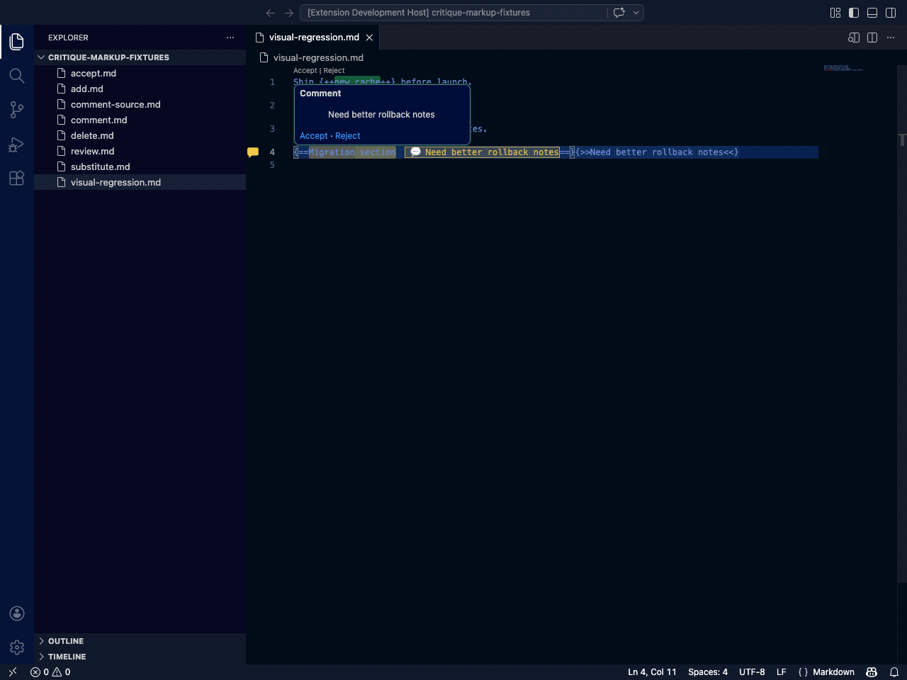
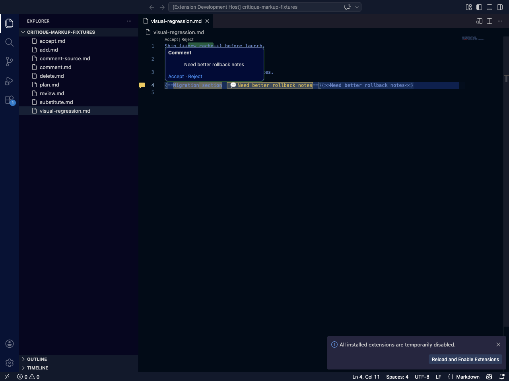
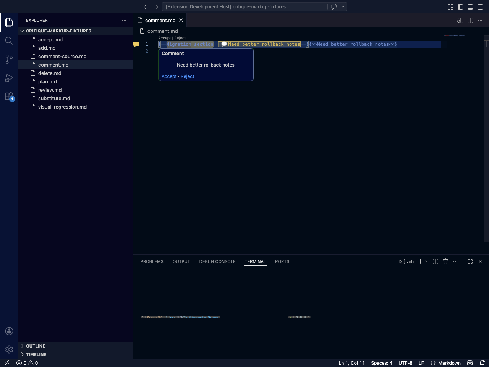
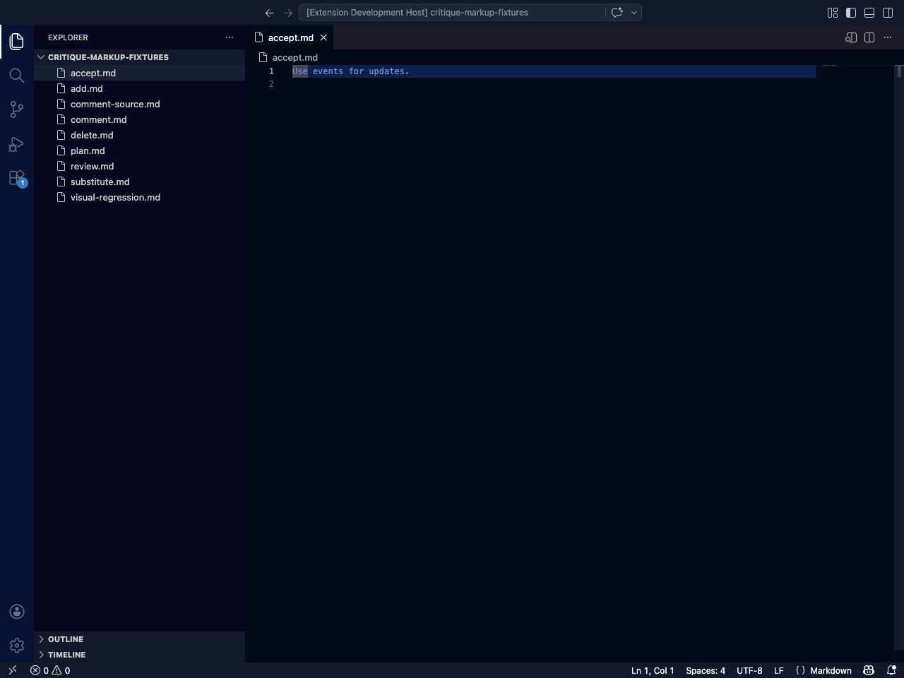
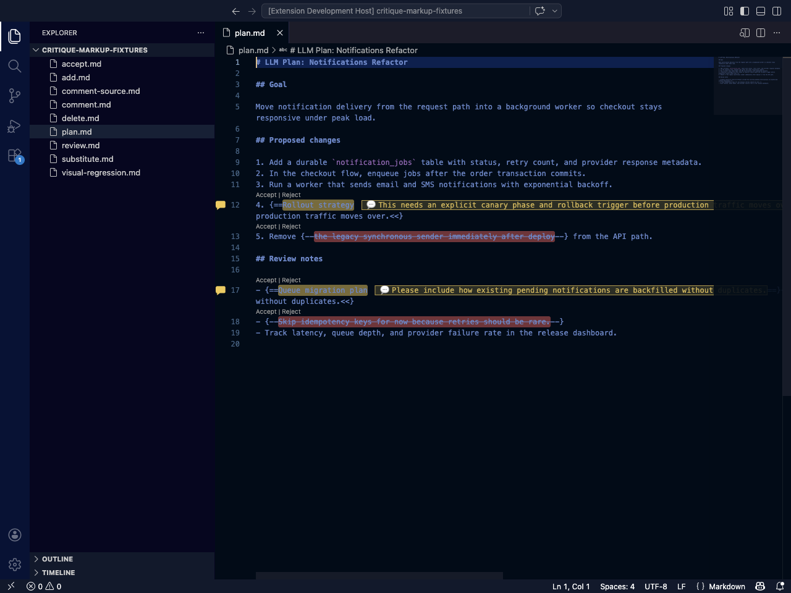
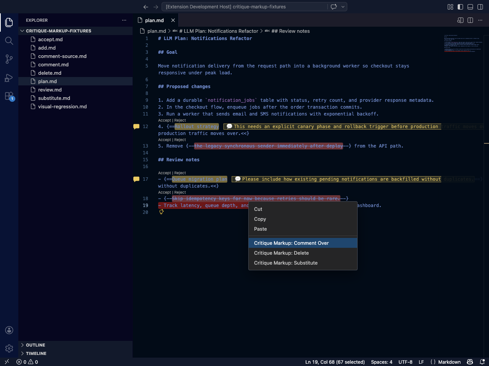

# Critique Markup for Markdown Comments

[](https://marketplace.visualstudio.com/items?itemName=xinbenlv.critique-markup-vscode-ext)
[](https://open-vsx.org/extension/xinbenlv/critique-markup-vscode-ext)

A Markdown comment layer for VS Code with UX closer to Google Docs comments, suggested edits, Microsoft Word revisions and redlining, and GitHub inline review comments or suggested code changes. It is especially useful for giving precise comments and review feedback on LLM-generated plans, specs, and implementation notes.

> Developer workflow, release steps, and publishing instructions live in [`DEVELOPER.md`](./DEVELOPER.md).

## Install

### From the marketplace UI

Search for `Critique Markup for Markdown Comments` in VS Code Extensions, or open:

- **VS Code Marketplace**: https://marketplace.visualstudio.com/items?itemName=xinbenlv.critique-markup-vscode-ext
- **OpenVSX Registry**: https://open-vsx.org/extension/xinbenlv/critique-markup-vscode-ext

### From the command line

```bash
code --install-extension xinbenlv.critique-markup-vscode-ext
```

## Visual tour



### Full-window snapshots

| Full feature review state | Add comment-over result | Accepted edit result |
| --- | --- | --- |
|  |  |  |
| LLM plan review state | Right-click comment command | |
|  |  | |

## What it does

- Renders Critic-style additions, deletions, substitutions, and comment-over annotations directly in Markdown.
- Highlights the annotated span instead of making you stare at raw markup soup.
- Adds inline **Accept / Reject** actions for each review block.
- Shows hover cards and gutter indicators for comment-bearing lines.
- Adds selection-aware editor right-click commands: **Comment Over**, **Delete**, and **Substitute** appear when text is selected, while **Add** appears when nothing is selected.
- Uses centered in-editor dialogs for prompts instead of VS Code's top-edge input strip.
- Keeps the workflow inside VS Code instead of bouncing you into a custom viewer.

## Comment-over syntax

Comment-over should use the target span first, then the attached comment:

```md
{==content to highlight==}{>>comment<<}
```

Example:

```md
{==Migration section==}{>>Need better rollback notes<<}
```

## Supported markup

```md
Ship {++new cache++} before launch.
Drop {--legacy polling--} entirely.
Use {~~polling~>events~~} for updates.
{==Migration section==}{>>Need better rollback notes<<}
```

## Commands

- `Critique Markup: Add`
- `Critique Markup: Delete`
- `Critique Markup: Substitute`
- `Critique Markup: Comment Over`
- `Critique Markup: Accept Review`
- `Critique Markup: Reject Review`

## Default shortcuts (macOS)

- **Add**: `Cmd+Alt+=`
- **Delete**: `Cmd+Alt+-`
- **Substitute**: `Cmd+Alt+\`
- **Comment Over**: `Cmd+Alt+/`

## Why this exists

Most Markdown review flows are clunky:

- raw Critic Markup is noisy
- separate custom viewers are a pain
- LLM-generated plans are fast to create but need precise, low-friction human review
- giving review feedback on AI-written Markdown should be as easy as commenting on a doc or reviewing a PR

This extension keeps review where it belongs: inside the editor you already use.

## Best fit

Critique Markup for Markdown Comments is built for people who:

- review Markdown plans, specs, and design docs
- iterate with AI on architecture or implementation notes
- want Google-Docs-style review cues without leaving VS Code
- prefer lightweight editorial markup over heavyweight doc tooling

## Status

Published on both VS Code Marketplace and OpenVSX, with automated VS Code tests and generated visual regression assets checked into the repo.
